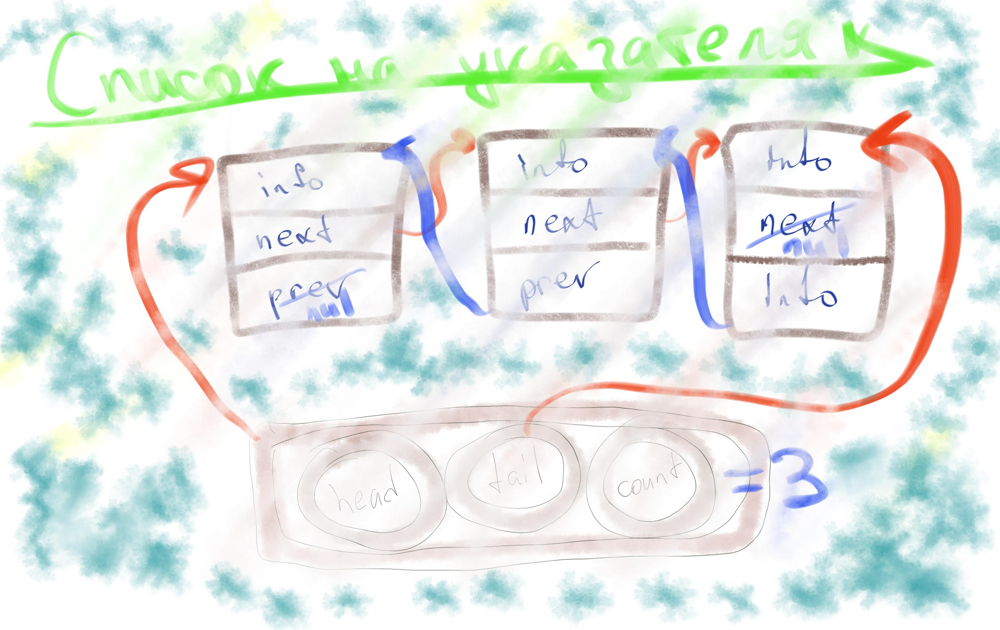

# Список
> вставка и удаление не зависит от длины списка
***

## вариант на массивах
### Удаление из списка

#### Реализация 1

нам необходимо удалить элемент, создадим двусвязный список на массивах

|      |  0 |1 | 2 | 3 | 4 | 5 | 6 | 7 | 
| :-- | :-: | :--: | :-: | :-: | :-: | :-: | :-: | :-: |
| data | яд | 10  | 20  |  30 | 40 | 50 |60  |70 |
| next |  0| 2 | **3**\4| **4**\0| 5|6 |7 | 0|
| prev | 0 | 0 | 1 | **2**\0 | **3** \ 2 | 4 | 5 | 6 |

для удаления заменим символы так как указано в таблице через **\\**

> {**0**} нулевой элемент отводим под яд, те ноль это указание, что такого элемента нет

посмотрим на пример кода такого алгоритма

```c
void ListRemove(List * list, int current_elemt)
{
...assert...
list->...
}
```

такой алгоритм будет очень медленный

#### Реализация 2 

создадим массив структур **data**, каждый элемент которого содержит 3 позиции: **info , next, prev**

запишем код для удаления элемента из списка на такой структуре

```c
void ListRemove(List * list, int curIdx)
{
...assert...
list->data[list->data[curIdx].prev].next = list->data[curIdx].next;
list->data[llis->data[curIdx].next].prev = list->data[curIdx].prev;
}
```

### Добавление в список

#### Реализация 1

|      |  0 |1 | 2 | 3 | 4 | 5 | 6 | 7 | 
| :-- | :-: | :--: | :-: | :-: | :-: | :-: | :-: | :-: |
| data | яд | 10  | 20  |  30 | 40 |  |  |35 |
| next |  0| 2 | 3| **4** / 7 | 5| | | 4|
| prev | 0 | 0 | 1 |  2 | **3** |  |  |3  |

Пусть мы хотим добавить элемент 7 после 3.
, тогда запишем в поле next у 7 элемента, поле next у элемента 3, а потом 

### Добавим переменные для удобства

1. free - следующий свободный элемент
2. head - начало занятых элементов
3. tail - конец занятых элементов
4. sorded - если список сортирован

 Также сделаем так: запишем в свободные элементы, а именно поля next номера следующий свободных элементов, таким образом, получится очередь из свободных элементов, где free указывает на первый свободный элемент. Последний свободный указывает на ничего

> полезно будет забить поля prev значение **-1**, тогда мы отличим пустые от не пустых 

**! Необходимо из удаленных элементов сделать пустой элемент, те указать _free_ - на свежеудаленный элемент**

добавим позиции начала и конца списка 

> достоинство - можно легко сохранить на диск

### Улучшение списка

1. Добавим сортировку 
2. отделим данные от адресов 

3.

dot dotty dotwiz программы в линукс для построения графов из файла как приведенный ниже

```bash
digraph A
{
    a -> b -> c
    a -> c 
    c -> c 
}
```
> на сайте деда есть Д.Байгушев, там примеры построения графов в dot 

на сайте sizeof.lj.ru есть ссылка на dot под windows

> полезно юзать system для построения графов прямо из программы


### Что в итоге нужно сделать 

1. Сделать список на структуре
2. Динамический размер 
3. Переменные для улучшения работы 
4. Методы для работы, как и при работе с массивом
5. Верификато - штука которая печатает список, и проверяет что соседние элементы имеют взаимные указатели. Пробежать назад и вперед и проверить целостность. Проверить на цикличность. Можно содержать количество элементов и считать длину по переходам и верифицировать.
6. Дампер - печать структуры списка в файл и построение в dotwiz

>подумать над физикой kntzn - на гите


## Список на указателях 




## Хеш таблица 

это когда выделяется свойство объектов и проводится сортировка по ним

надо написать функцию, которая берет хеш строки 

символы попарно XOR и вращаем биты 

вторым заданием разобраться с gnu hash 

> Берём данные на сайте деда, там есть англо-русский словарь. Его нужно отсортировать при помощи хеш функции.

Нужно создать хештаблицу, где позиции - списки 

```c
hashInsert(Hash * hashTable, cosnt char * word)
{
    listHasck(hashTable[hashTable->func(word) % size], word); // тут % на size чтобы все было в пределах таблицы
}
```

### задача на лабу на хештаблицы
S
1. делаем хеш таблицу и наполняем ее строками нашей функцией
2. сохраняем распределение количества строк в каждой функции
3. строим графики всех функций в excel
4. анализируем