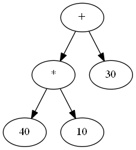

# Universal tree format v1.0

## How to save tree?

### In file it should look like this

```c
((30)+(40)*(10))
```

this look like this in dot



### list of commans

* '+'
* '-'
* '*'
* '/'
* 'sin()'
* 'cos()'
* number